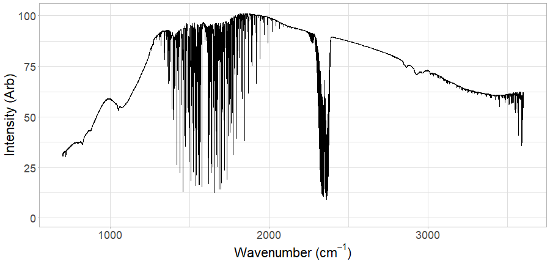
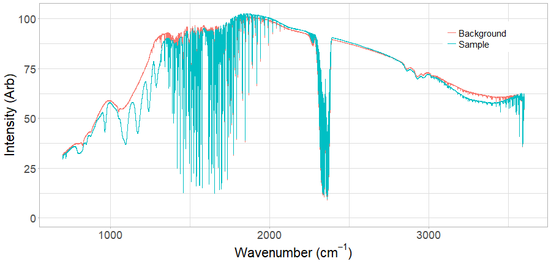
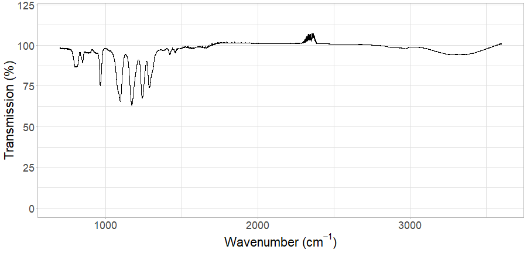

---

title       : Developing Data Products Reproducible Pitch 
subtitle    : Transmission Spectrum Viewer
author      : Michael Lawson
job         : R&D Scientist
framework   : io2012        # {io2012, html5slides, shower, dzslides, ...}
highlighter : highlight.js  # {highlight.js, prettify, highlight}
hitheme     : tomorrow      # 
widgets     : [mathjax]            # {mathjax, quiz, bootstrap}
mode        : selfcontained # {standalone, draft}
knit        : slidify::knit2slides

---

## Introduction

* Under certain circumstances, photons can interact with molecules. You can think of the molecule as being an antenna, capable of soaking up incoming EM energy. We can distinguish chemicals by shining light on them and checking to see if characteristic light frequencies are attenuated.
* If we record light flux as a function of light frequency we have what is called a "spectrum". The study of the interaction of light with matter is called "spectroscopy".
* When examining a spectrum, it is important to consider it is not only the chemical of interest that can attenuate the light. Variations in source intensity, for example, can overlay the desired signal.
* To overcome these difficulties, it is common to normalize a spectrum by recording a "background" spectrum, where no sample is present, as well as a sample spectrum. The sample transmission spectrum is created by dividing the sample spectrum by the background spectrum.
* The data product developed for this project attempts to make the process of visualizing a transmission spectrum, from two arbitrary spectra, more easily accomplished.

--- 

## Example Background Spectrum

* This is an example of a background spectrum. You can see it has dips all over the place. This come about through contamination of the spectrometer optics and atmospheric gases, e.g. carbon dioxide at ~2300 /cm.

---
## Example Sample Spectrum Overlay

Here I've overplayed a sample spectrum onto the background spectrum I showed earlier. Note that most of the dips are the same, but some are not. The extra dips come from the sample.

---

## Transmission Spectrum

Dividing the sample spectrum by the background spectrum gives the transmission spectrum. This normalises the spectrum so that only the sample absorbances are shown, in turn making it easier to quantify the sample.

